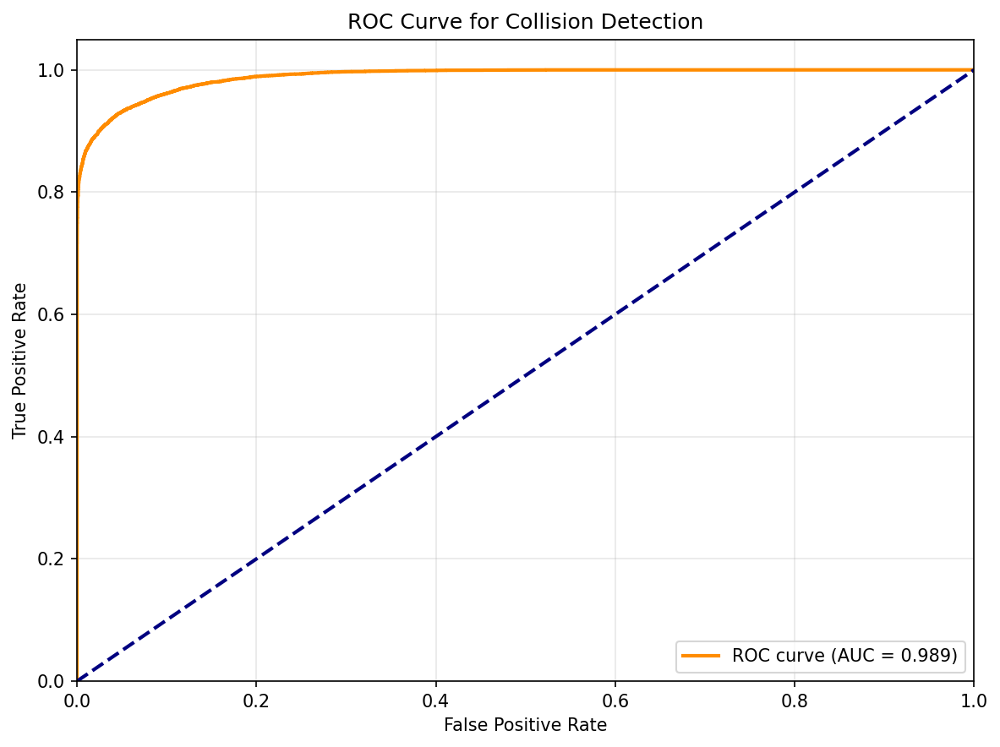
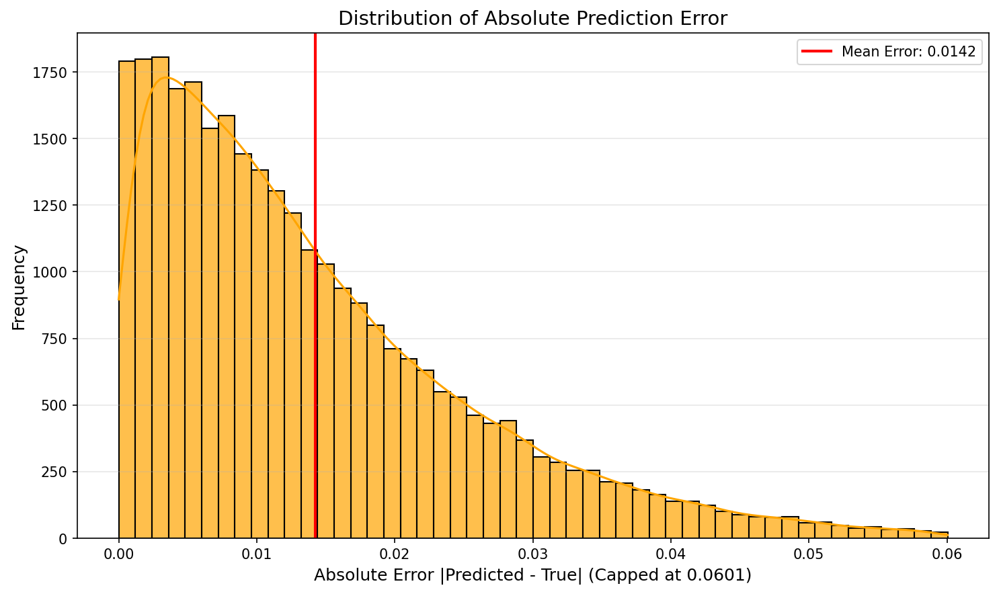
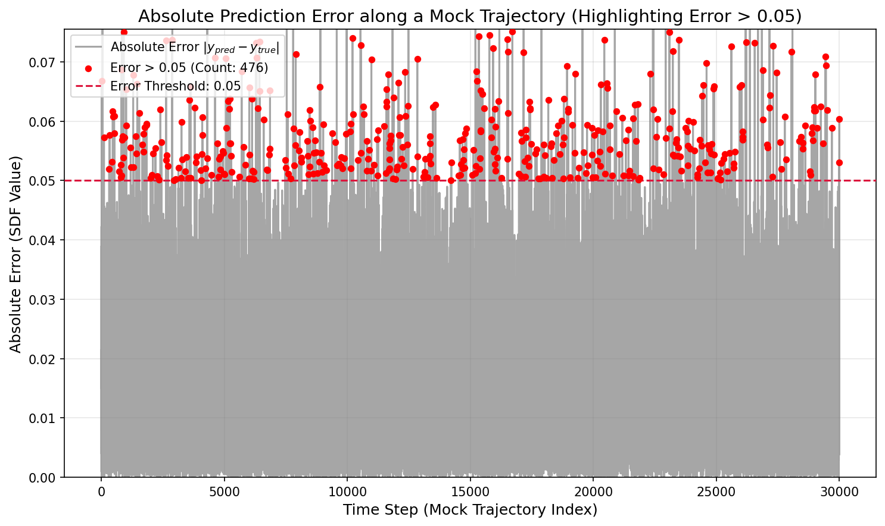
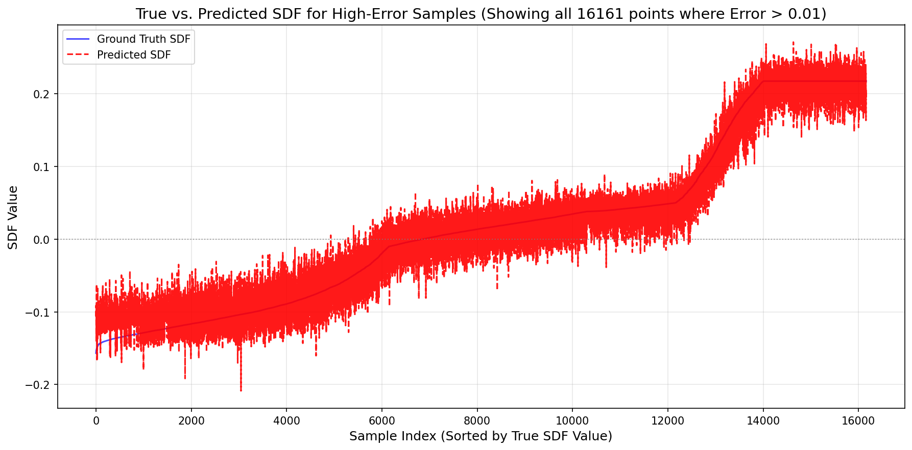
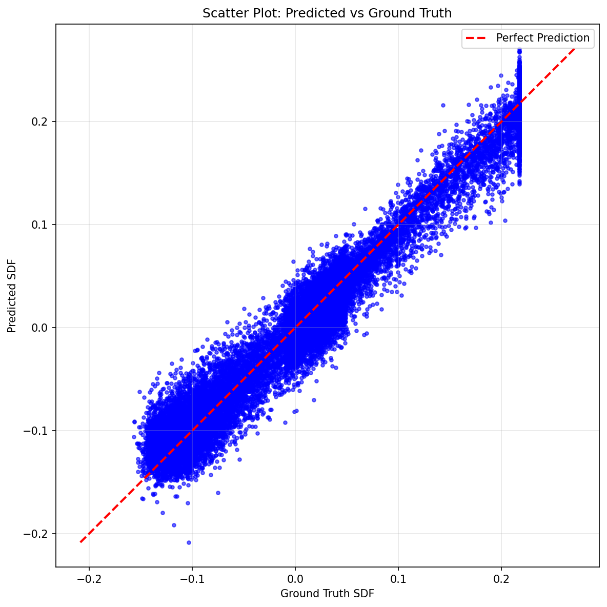
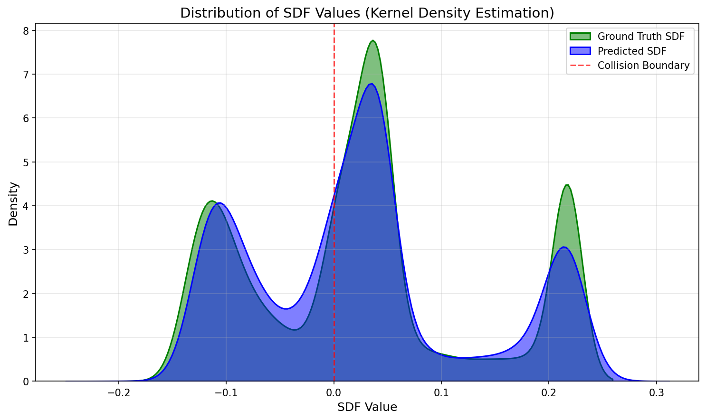

-----

# 🚀 Fast-CD V2: Real-time Collision Detection via Learned SDF

**Fast-CD V2** 是一个基于深度学习的高性能碰撞检测框架，专为 UR10e 机械臂设计。该项目通过训练神经网络回归 **带符号距离场 (SDF)**，替代了传统昂贵的几何碰撞检测计算。

在复杂的障碍物环境下，该模型在 GPU 上实现了 **33µs (微秒)** 的单次推理延迟，相比 MuJoCo 物理引擎（CPU）加速了 **28.5倍**，且在大批量并行检测下吞吐量高达 **1400万样本/秒**。

-----

## 📊 Key Results (Performance Highlights)

基于 RTX GPU 与 MuJoCo (CPU) 的基准测试对比：

| Metric | Method | Value | Note |
| :--- | :--- | :--- | :--- |
| **Latency** (Single Query) | **Neural SDF (Ours)** | **33.38 µs** | **CUDA Graphs Enabled** |
| | MuJoCo (Ground Truth) | 950.10 µs | Standard Physics Engine |
| **Speedup** | -- | **28.5x Faster** | 🚀 |
| **Throughput** (Batch) | **Neural SDF (Ours)** | **14,647,937 samples/s** | Batch Size = 4096 |
| **Accuracy** | Recall (Safety) | **99.87%** | Threshold = 0.05 |
| | MAE (Boundary) | 0.0201 | Near SDF=0 region |

> **Log Output:** `Avg Latency: 33.380 µs/pass` | `Speedup: 28.5x faster`

-----

## 🛠️ Project Architecture

本项目包含三个核心模块：数据生成、模型训练与极速推理。

### 1\. Data Generation (`generate_data_IK.py`)

我们使用mujuco中设置的场景作为模拟场景来训练模型，如下图：

为了训练高精度的 SDF 模型，数据质量至关重要。本项目采用 **混合采样策略**：

  * **全局随机采样 (Global Random):** 覆盖整个关节空间，捕捉远距离安全区域。
  * **基于 IK 的主动探测 (IK-based Proximity):** 利用逆运动学 (Inverse Kinematics) 强制生成靠近障碍物表面的样本。
  * **边界二分插值 (Boundary Bisection):** **(关键技术)** 在碰撞点和安全点之间进行二分查找，精确锁定 $SDF \approx 0$ 的决策边界，大幅提升边界预测精度。
  * **Output:** HDF5 格式数据集 (`train/test`), 包含关节角 $q \in \mathbb{R}^6$ 和 真实 SDF 值。

### 2\. Model: RNDF-MLP (`train_v2.py`)

模型采用改进的 **Residual MLP** 结构，包含以下特性：

  * **Positional Encoding:** 将关节角映射为 $[\sin(q), \cos(q)]$，解决周期性问题。
  * **Skip Connections:** 类似于 ResNet，防止梯度消失并保留高频特征。
  * **Dual-Head Output:**
    1.  **Regression Head:** 预测连续的 SDF 值。
    2.  **Classification Head:** 辅助预测二分类（碰撞/安全），增强特征提取。
  * **Loss Function:** `Weighted MSE` (关注边界误差) + `BCE With Logits` (分类辅助)。
  * **Export:** 最终模型导出为 **TorchScript (.pt)**，支持 C++ 部署和无 Python 依赖运行。

### 3\. Optimized Inference (`infer_v2.py`)

为了达到微秒级延迟，推理脚本进行了极致优化：

  * **CUDA Graphs:** 录制 GPU内核启动序列，消除 CPU 调度开销（对于 Batch=1 的场景至关重要）。
  * **Tensor Pre-allocation:** 避免推理循环中的显存分配。
  * **JIT Compilation:** 使用 TorchScript 加速计算图执行。

-----

## 📂 File Structure

```text
.
├── dataset/                  # Generated HDF5 datasets
│   ├── sdf_dataset_train.h5
│   └── sdf_dataset_test.h5
├── model/                    # MuJoCo assets
│   ├── universal_robots_ur10e/
│   │   ├── ur10e.xml
│   │   └── scene_with_spheres.xml
├── models/                   # Trained models
│   ├── best_sdf_class_model.pth  # Checkpoint with weights
│   └── fast_sdf_model_mixed.pt   # TorchScript model for deployment
├── plots/                    # Evaluation visualizations
│   ├── roc_curve.png
│   ├── error_over_trajectory_curve.png
│   └── large_error_diff_curve_0.01.png
├── generate_data_IK.py       # Data generation script
├── train_v2.py               # Training script (Dual-head MLP)
├── infer_v2.py               # Benchmarking & Visualization script
└── README.md
```

-----

## 🚀 Quick Start

### Prerequisites

  * Python 3.8+
  * PyTorch (CUDA recommended)
  * MuJoCo (`pip install mujoco`)
  * h5py, matplotlib, tqdm, seaborn, sklearn

### Step 1: Generate Dataset

生成包含 150,000 个样本的平衡数据集（安全:边界:碰撞 ≈ 3:4:3）。

```bash
python generate_data_IK.py
```

### Step 2: Train Model

训练混合损失模型（SDF回归 + 碰撞分类）。

```bash
python train_v2.py
```

*训练结束后，模型将自动导出为 `models/fast_sdf_model_mixed.pt`。*

### Step 3: Benchmark & Visualize

运行基准测试并生成评估图表。

```bash
python infer_v2.py
```

-----

## 📈 Visualization & Analysis

### 1\. Accuracy Analysis

  * **ROC Curve:** AUC 极高，证明模型能完美区分碰撞与安全状态。
  
  * **Error Distribution:** 绝大多数误差集中在 $10^{-3}$ 级别。
  
  * **Trajectory Error:** 在模拟轨迹中，只有极少数点的误差超过安全阈值（如下图所示）。



*(Absolute prediction error along a mock trajectory. Red dots indicate rare high-error outliers)*

### 2\. High Error Analysis

我们重点关注了误差 \> 0.01 的样本。如下图所示，即使在大误差样本中，预测值（红色虚线）依然紧密跟随真实值（蓝色实线）的趋势，没有出现灾难性的反向预测。



整体的误差分布如下：


整体的预测值与真实值分布如下：


-----

## 💡 Why CUDA Graphs?

在 `infer_v2.py` 中，你可以看到如下输出：

```text
🚀 [Optimized Benchmark] Mode: Latency (Single) | Batch: 1
✅ CUDA Graphs: Enabled (CPU overhead eliminated)
Avg Latency: 33.380 µs/pass
```

对于小 Batch（如机器人实时控制中的单次查询），GPU 的计算时间极短，**CPU 发射 Kernel 的开销**（Kernel Launch Overhead）成为了瓶颈。本项目使用 **CUDA Graphs** 录制整个计算图，一次性发射，从而消除了 CPU 开销，将延迟从 \~150µs 压榨至 \~30µs。

-----

## 📝 Future Work

  * **Active Learning:** 将推理中误差较大的区域反馈给生成器，进行针对性重采样。
  * **Dynamic Scenes:** 目前仅支持静态障碍物，未来可加入障碍物位置作为网络输入，实现动态避障。
  * **C++ Deployment:** 利用导出的 TorchScript 模型，在 C++ 控制器（如 ROS）中直接加载，实现硬实时控制。

-----

## 📧 Contact

**Author:** STEVEN LI
**Date:** 2025-11-26
**Project:** Fast-CD V2 (Collision Detection Acceleration)